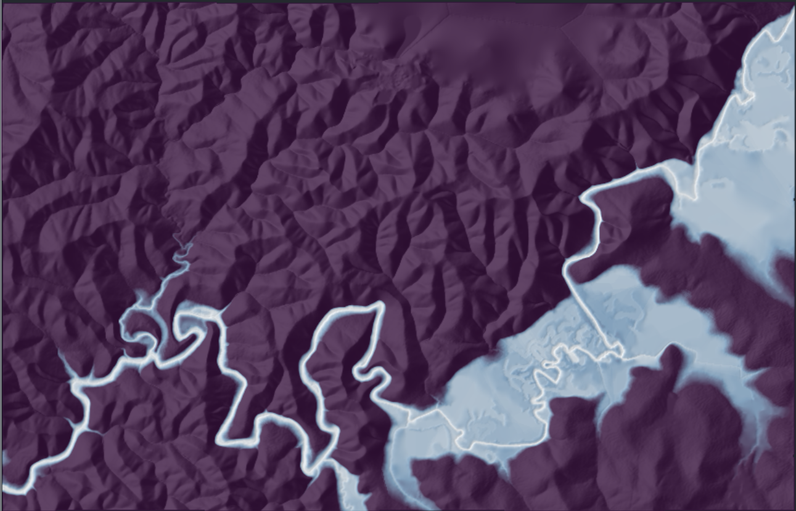

# DEM data exploration and relative elevation modelling
**[Rioxarray](https://corteva.github.io/rioxarray/stable/), [Xarray](https://docs.xarray.dev/en/stable/), [OSMnX](https://osmnx.readthedocs.io/en/stable/) and [Datashader](https://datashader.org/#)**

Jupyter notebook exploring DEM data in geotiff format and generating a relative elevation model for a section of the Yarra River, Victoria, Australia.

Based on [REM-xarray](https://github.com/DahnJ/REM-xarray) by [DahnJ](https://github.com/DahnJ)

# Run this notebook

```bash
python -m venv rem-tutorial
source rem-tutorial/bin/activate
pip install -r requirements.txt
jupyter notebook
```

### Downloading the data
- [Victoria Elevation DEM 10m](https://discover.data.vic.gov.au/dataset/vicmap-elevation-dem-10m) data downloaded through the [ELVIS portal](https://elevation.fsdf.org.au/)
- [Yarra River feature data](https://www.openstreetmap.org/relation/2211681) imported with the OSMnX package